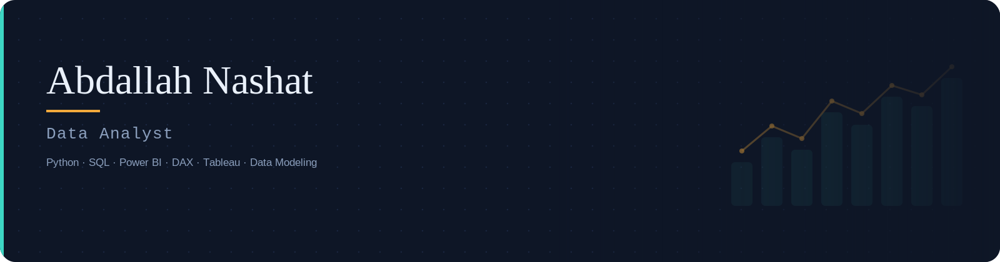

  <em>Junior Data Analyst turning raw data into decisions — SQL, Power BI, Python, and Excel.</em>

  
  
  
  

---

### About Me

Junior Data Analyst with a foundation in Mathematics, Statistics, and Computer Science. I work across the full analytics lifecycle — cleaning and modeling data, writing DAX and SQL, and building dashboards that surface KPIs and business-ready insights. Recent focus: sales, marketing, and operations analytics using Power BI, Excel, and SQL Server.

---

### Skills

**Programming & Querying**

  
  
  
  

**BI & Data Visualization**

  
  
  
  
  

**Data Analysis**

  
  
  
  

**Data Management & Marketing Analytics**

  
  
  
  
  

---

### Featured Projects

| Project | Highlights | Tools |
|---|---|---|
| **[Sales Performance Dashboard](https://github.com/Abdallahnashat/SalesPerformance_Report.git)** | $17.91M in tracked sales at 103.72% of target; salesperson ranking & growth-gap analysis | Power BI, DAX, Power Query, Deneb |
| **[Sales & Operations Performance Analysis](https://github.com/Abdallahnashat/Sales-Operations-Performance-Analysis.git)** | 6-page dashboard covering $78.87M revenue, $24.7M profit, 3,796 orders; YoY/MoM time-intelligence, churn model on 701 customers | Power BI, DAX, Power Query |
| **[Multi-Channel Marketing Performance Analysis](https://github.com/Abdallahnashat/Multi-Channel-Marketing-Performance-Analysis.git)** | £163K ad spend / 40K+ conversions across Facebook, Instagram, Pinterest; Pinterest flagged as highest-ROI channel (22.5x ROAS) | Excel, PivotTables |
| **[Advanced SQL Analytics for Sales Intelligence](https://github.com/abbbbbdd)** | Star-schema queries, window functions, multi-layered CTEs, RFM-style KPIs (Recency, Lifespan, Tenure) | MS SQL Server |
| **[Post-Filtering System](https://github.com/abbbbbdd)** | Text/image/video content filtering using YOLO, Naive Bayes, and OpenCV | Python, YOLO, OpenCV |

> Replace the placeholder links above with the actual repo URLs once you push each project.

---

### Experience

**Data Analyst — Data Collection, Shali App** · Remote · March 2025 – March 2026
Collected, cleaned, and structured datasets for a medical-tourism app (doctors, landmarks, facilities), with data quality checks feeding downstream analytics.

---

### Education

**B.Sc. Computer Science** — Faculty of Engineering, Suez Canal University · 2019 – 2024 · GPA 3.23/4.0

---

  

